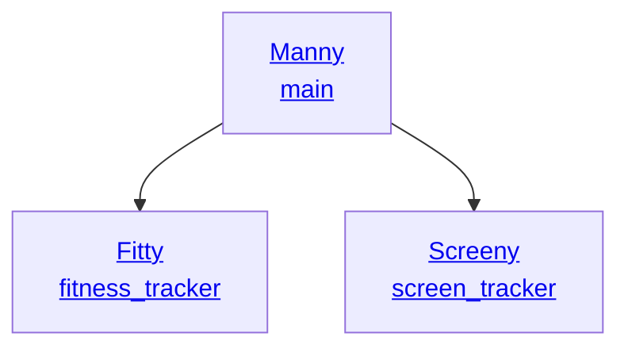
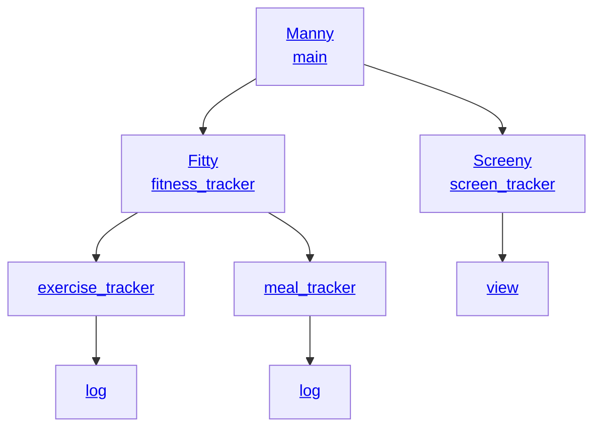
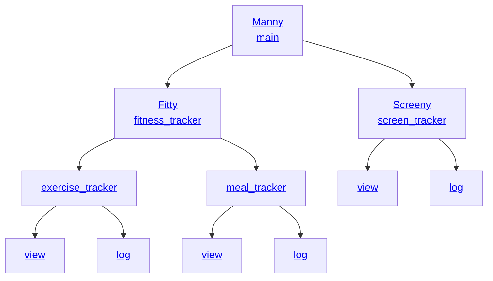

## 1

```mermaid
graph TD

A[<a href='http://google.com'>Manny\nmain</a>] --> B[<a href='http://google.com'>Fitty \nfitness_tracker</a>]
A --> C[<a href='http://google.com'>Screeny\nscreen_tracker</a>] 
```

## 2

```mermaid
graph TD

A[<a href='http://google.com'>Manny\nmain</a>] --> B[<a href='http://google.com'>Fitty \nfitness_tracker</a>]
A --> C[<a href='http://google.com'>Screeny\nscreen_tracker</a>] 
B --> D[<a href='http://google.com'>exercise_tracker</a>]
B --> E[<a href='http://google.com'>meal_tracker</a>]
C --> F[<a href='http://google.com'>view</a>]
D --> I[<a href='http://google.com'>log</a>]
E --> K[<a href='http://google.com'>log</a>]
```

## 3

```mermaid
graph TD

A[<a href='http://google.com'>Manny\nmain</a>] --> B[<a href='http://google.com'>Fitty \nfitness_tracker</a>]
A --> C[<a href='http://google.com'>Screeny\nscreen_tracker</a>] 
B --> D[<a href='http://google.com'>exercise_tracker</a>]
B --> E[<a href='http://google.com'>meal_tracker</a>]
C --> F[<a href='http://google.com'>view</a>]
C --> G[<a href='http://google.com'>log</a>]
D --> H[<a href='http://google.com'>view</a>]
D --> I[<a href='http://google.com'>log</a>]
E --> J[<a href='http://google.com'>view</a>]
E --> K[<a href='http://google.com'>log</a>]
```